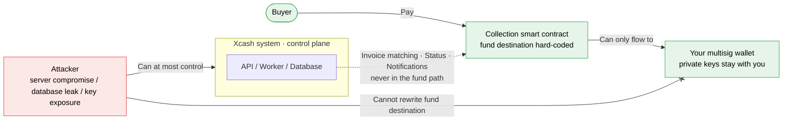
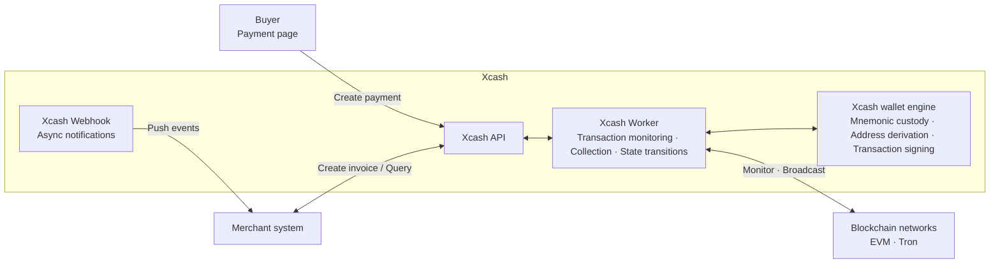

# Xcash

<p align="center">
  <strong>Open-source self-hosted cryptocurrency collection gateway</strong>
  <br />
  Accept USDT, ETH, and assets across major EVM chains and Tron with zero platform fees and full self-custody.
</p>

<p align="center">
  <a href="https://xca.sh"></a>
  <a href="https://xca.sh/docs/"></a>
  <a href="https://github.com/xca-sh/xcash/stargazers"></a>
  <a href="LICENSE"></a>
  
  
</p>

<p align="center">
  English | <a href="README.md">Simplified Chinese</a>
</p>

## What is Xcash?

**Xcash** is an advanced open-source, self-hosted **cryptocurrency collection gateway** for merchants, SaaS products, exchanges, and wallet platforms. It provides cryptocurrency collection, USDT collection, and on-chain deposit capabilities.

For full deployment, configuration, and API integration instructions, see the [Xcash documentation](https://xca.sh/docs/).

Unlike hosted payment processors such as CoinGate or OpenNode, Xcash emphasizes **full self-custody**: funds flow through smart contracts directly to your multisig wallet address. Xcash never takes custody of funds and charges no platform fee. It is designed for business systems that need multi-chain asset collection, deposits, and webhook notifications.

**Use cases:** e-commerce cryptocurrency payments, USDT deposit systems, cross-border stablecoin settlement, SaaS cryptocurrency subscription billing, on-chain collection infrastructure, and internal enterprise digital asset crediting.

## How safe is Xcash?

For example, if you use Xcash as your project's cryptocurrency collection gateway, even if the server running Xcash is compromised, the database is leaked, or system keys are exposed, your assets remain safe as long as your multisig wallet address is not tampered with. After service is restored, user payments still flow into your multisig wallet, and the attacker cannot redirect them.

## Why is Xcash so safe?

Security is a built-in property of Xcash and one of its core principles.

- Xcash never takes custody of your collections.
- All collections go through smart contracts, and the smart contracts hard-code the fund destination as your multisig wallet.
- Collection contracts are intentionally minimal, with almost no attack surface.



The fund path, shown in green, is fixed by smart contracts and only flows from "buyer -> collection contract -> your multisig wallet". Xcash is only the control plane, responsible for invoice matching, state transitions, and notifications. **It is not in the fund path**. Even if an attacker fully controls the Xcash system, they cannot rewrite the hard-coded fund destination inside the contract.

## Features

| Feature | Detail |
|---------|--------|
| Invoice payments | Fixed-amount, time-limited invoice collection for checkout, subscription billing, and similar scenarios |
| Dedicated deposit addresses | Assign a dedicated deposit address to each user so they can transfer in anytime and be credited after confirmation, like an exchange |
| Full self-custody | Collections flow through smart contracts directly to your wallet; Xcash never takes custody of funds |
| Zero platform fees | No transaction percentage fee; only small on-chain gas costs apply |
| Multi-chain and multi-asset | Covers major EVM chains, with support for arbitrary ERC-20 tokens |
| Multi-merchant and multi-project | Manage multiple merchants and projects in isolation on a single instance |
| Contract invoices | EVM chains can generate an independent VaultSlot collection address for each invoice |
| On-chain risk control | Integrates MistTrack risk scoring for source addresses of payments and deposits |
| Webhook callbacks | Push payment and deposit events in real time |
| EasyPay compatibility | Supports the standard EasyPay V1 protocol for smooth migration |
| Docker deployment | One-command production deployment with Docker Compose |

## Payments vs. Deposits

Xcash provides two ways to receive funds. Distinguish them before integration:

- **Payments**: invoice-based collection. Each transaction creates a fixed-amount, time-limited invoice, and the invoice completes after the buyer pays. This is suitable for one-off collection scenarios such as e-commerce checkout and subscription billing. Payments use VaultSlot contract collection by default: the system assigns an independent collection address to each invoice, avoiding address collisions and amount offsets.
- **Deposits**: exchange-style top-ups. Each user gets a dedicated deposit address shared across chains, monitored in real time. Users can transfer in anytime and be credited after block confirmation without creating an order. This is suitable for wallets, trading platforms, and other businesses that maintain user balances.

## Chain Support

| Feature | ETH | BNB Chain | Arbitrum | Base | Tron | Polygon | Avalanche | Optimism | Other EVM |
|:--:|:---:|:---------:|:--------:|:----:|:----:|:-------:|:---------:|:--------:|:------:|
| Payment | Yes | Yes | Yes | Yes | No | Yes | Yes | Yes | Almost all |
| Deposit | Yes | Yes | Yes | Yes | No | Yes | Yes | Yes | Almost all |

## Token Support

EVM chains support arbitrary ERC-20 tokens. Add the token contract address in the admin panel to enable assets such as USDT, USDC, or other on-chain assets required by your business.

Tron VaultSlot collection is still being integrated and is not currently exposed for payments or deposits.

## Built-in Risk Control Integration

Xcash includes risk query, caching, persistence, and display capabilities. Current risky-address detection depends on external MistTrack services and is not an internally maintained blacklist or custom on-chain risk model.

Risk checks currently cover two core fund entry points:

- **Payment invoices**: after an invoice is matched with an on-chain payment, the system asynchronously checks the payer address and stores the risk level and risk score on the invoice record.
- **User deposits**: after a deposit record is created, the system asynchronously checks the source address and stores the risk level and risk score on the deposit record.

Risk results are also written to dedicated **risk assessment** records, including query status, target type, source address, transaction hash, risk level, and risk score. The admin panel can directly display risk information from invoices, deposits, and risk assessments so operators can manually review, release, or further handle suspicious funds. Invoice and deposit API/webhook output also includes `risk_level` and `risk_score`, making it easier for merchant systems to display risk information or connect their own handling process.

Xcash prefers MistTrack OpenAPI V3. If no MistTrack OpenAPI API key is configured, it falls back to the QuickNode MistTrack add-on.
If neither is configured, risk control is disabled.

## Screenshots


## Architecture



## Deployment Preparation

Before deployment, prepare the following:

- Linux server, recommended Ubuntu 22.04+ or Debian 12+
- Docker and Docker Compose
- A domain name resolved to the server IP
- RPC endpoints for the public chains you want to enable
- A TronGrid API key if you need to enable Tron payments

Recommended server profiles:

| Performance mode | Hardware | EVM chain capacity |
|:-------:|:-------:|:-----------:|
| low | 1 CPU / 2 GB | 2 - 3 EVM chains |
| medium | 4 CPU / 8 GB | 8 - 15 EVM chains |
| high | 8 CPU / 16 GB | 15 - 30 EVM chains |

`PERFORMANCE` is a performance parameter that can be set in `.env`. Valid values are `low`, `medium`, and `high`. If unset, it defaults to `low`.

EVM payments and deposits are both detected and confirmed through on-chain event scanning, and both are enabled by default and monitored together. Actual chain capacity depends on RPC throughput, block speed, and event volume, so configure the performance profile conservatively according to the table above.

## Quick Start

### 1. Clone the repository

```bash
git clone https://github.com/xca-sh/xcash.git
cd xcash
```

### 2. Initialize environment variables

```bash
./scripts/init_env.sh
```

This command generates `.env` and automatically fills the random secrets and database password required at runtime.

### 3. Configure the access domain

Edit `.env` and set `SITE_DOMAIN`:

```env
SITE_DOMAIN=xcash.example.com
```

Make sure the domain DNS resolves to the server IP, and configure a reverse proxy such as Nginx or Caddy to forward traffic to `http://localhost:6688`.

Optional: set `ADMIN_PATH` to move the admin entrance to a custom path, for example:

```env
ADMIN_PATH=secure-admin
```

If unset, the admin remains mounted at the site root and shows a security reminder in the top-right admin badge.

### 4. Start services

```bash
docker compose up -d
```

On first startup, if the database has no admin account, the system automatically creates the default admin account:

```text
username: admin
password: Admin@123456
```

Change the default password immediately after first logging in to the admin panel.

### 5. Configure chain RPC

The system comes with basic information for mainstream chains, but **RPC endpoint addresses must be filled in manually** before the gateway can communicate with blockchains.

Log in to the admin panel, go to **Blockchain** **Public chains**, and fill in RPC endpoints for the chains you want to use. Recommended providers include [QuickNode](https://www.quicknode.com/), [Alchemy](https://www.alchemy.com/), and [Infura](https://www.infura.io/). Tron payments require a [TronGrid](https://www.trongrid.io/) API key.

### 6. Fund the system wallet with Gas

Log in to the admin panel, go to **System** **System wallets**, copy the system wallet address, and send a small amount of gas token to that address on each enabled EVM chain, such as ETH, BNB, or MATIC.

The system wallet is only used for platform infrastructure transactions, such as VaultSlot contract deployment and VaultSlot collection tasks that must be actively initiated by the system. Business collection funds still flow to your collection address according to contract rules. Do not deposit business funds here; keep only a small gas balance that covers recent operations, so contract deployments or collection tasks are not blocked by insufficient gas.

### 7. Configure a project

Log in to the admin panel, go to **Projects** **Project list**, and create or edit a project. A project is the basic isolation unit for API integration. Each project has its own `Appid` and `HMAC secret` for API authentication and signing.

Confirm at least the following configuration:

- **IP whitelist**: restricts merchant server IPs allowed to call gateway APIs. Use `*` during testing if needed, but production should be narrowed to fixed egress IPs or CIDR ranges.
- **Notification URL**: receives payment, deposit, and other webhook events. If not configured, the project is shown as not ready.
- **Collection address**: the final destination of business funds. Before enabling contract payments or deposits, configure an EVM multisig address. This address is written into VaultSlot contract rules and cannot be modified after it is set.

## API Integration

After deployment, see the [API integration documentation](https://xca.sh/docs/#api-base) to integrate payments, deposits, and webhook callbacks.

Invoice creation can include an invoice-level `notify_url` to override the project default webhook. The EasyPay V1-compatible `submit.php` entry also maps `notify_url` to the invoice-level notification URL.

## Operations Commands

### Stop services

```bash
docker compose down
```

This stops and removes production Docker Compose service containers without deleting database volumes.

### Upgrade to the latest version

```bash
./scripts/upgrade.sh
```

This command pulls the latest `main` branch and runs the full production upgrade flow.

## Tech Stack

- **Backend**: Django 5.2 + Django REST Framework
- **Task queue**: Celery + Redis
- **Database**: PostgreSQL
- **Blockchain interaction**: web3.py for EVM
- **Wallet derivation**: BIP44 HD wallets with bip-utils
- **Payment frontend**: React 19 + Vite + Tailwind CSS
- **Deployment**: Docker Compose

## Roadmap

- [ ] Solana support
- [x] Tron support
- [ ] Documentation website

## Cloud Service

If you do not want to deploy and maintain Xcash yourself, use the official hosted version:

**[xca.sh](https://xca.sh)** - ready to use, no deployment required, continuously updated.

## Commercial Support

For professional help with deployment or usage, contact us for technical support:

tech@xca.sh

## Contributing

Issues and pull requests are welcome.

## License

[MIT](LICENSE)
