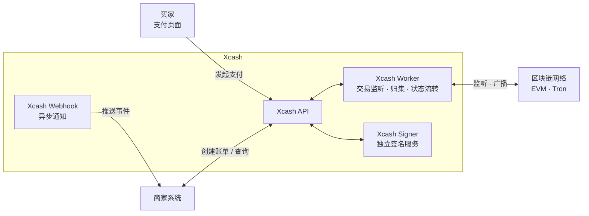

# Xcash

<p align="center">
  <strong>开源自托管加密货币支付网关</strong>
  <br />
  支持 USDT、ETH 与 100+ 链上资产收款，零平台手续费，完全自托管。
</p>

<p align="center">
  <a href="https://xca.sh"></a>
  <a href="https://github.com/xca-sh/xcash/stargazers"></a>
  <a href="LICENSE"></a>
  
  
</p>

<p align="center">
  <a href="README.en.md">English</a> | 简体中文
</p>

## 什么是 Xcash？

**Xcash** 是一个开源、自托管的**加密货币支付网关**，面向商家、SaaS 产品、交易所和钱包平台，提供加密货币收款、USDT 收款、链上充值和提币能力。

不同于 CoinGate、OpenNode 这类托管式支付处理商，Xcash 强调**完全自托管**：私钥保留在你的基础设施内，支付直达你的链上钱包地址，Xcash 不抽取平台手续费。它适合需要多链资产收款、充值、提币和 Webhook 通知能力的业务系统。

**适用场景：** 电商加密货币收款、USDT 充值和提现系统、跨境稳定币结算、SaaS 加密货币订阅计费、类似交易所的钱包基础设施，以及企业内部数字资产管理。

## 核心能力

| 功能 | 说明 |
|------|------|
| 支付网关 | 支持 USDT、ETH 与其他 100+ 链上资产收款 |
| 合约账单 | EVM 链可为每张账单生成独立 CREATE2 收款地址 |
| 完全自托管 | 私钥保留在你的基础设施内 |
| 零平台手续费 | 不按交易抽成，仅承担链上 Gas |
| 充提币 | 提供类似交易所的充值和提现流程 |
| Webhook 回调 | 实时推送支付、充值、提现事件 |
| 风控接入 | 接入 MistTrack 链上地址风险评分 |
| 兼容易支付 | 支持标准易支付 V1 协议 |
| Docker 部署 | 使用 Docker Compose 部署生产服务 |

## 链支持

| 功能 | ETH | BNB Chain | Arbitrum | Base | Tron | Polygon | Avalanche | Optimism | 其他 EVM |
|:----:|:---:|:---------:|:--------:|:----:|:----:|:-------:|:---------:|:--------:|:--------:|
| 支付 | 是 | 是 | 是 | 是 | 是 | 是 | 是 | 是 | 是 |
| 充值 | 是 | 是 | 是 | 是 | 否 | 是 | 是 | 是 | 是 |
| 提币 | 是 | 是 | 是 | 是 | 否 | 是 | 是 | 是 | 是 |

所有 EVM 兼容链均可通过后台配置接入，无需额外开发。

## 代币支持

EVM 链支持任意 ERC-20 代币，只需在后台添加代币合约地址即可启用，适合按业务需要接入 USDT、USDC 或其他链上资产收款。

Tron 链当前仅支持支付功能，且主要面向 TRC20-USDT 收款场景。

## 合约账单

Xcash 支持两种账单计费模式：

- **差额账单**：默认模式，通过收款地址和微小金额差额识别账单，适合全部已支持链。
- **合约账单**：EVM 专用模式，通过 CREATE2 为每张账单、每个支付方式预测独立 collector 地址。买家付款到该地址后，系统匹配账单并在确认完成后自动部署 collector，将资金归集到项目配置的收款地址。

合约账单的优势：

- **独立地址识别**：每张账单使用独立收款地址，不依赖金额差额，买家看到的金额更自然。
- **高并发友好**：相同币种、相同金额的多笔订单不会争抢同一组地址与差额档位，降低高峰期分配失败概率。
- **付款容错更高**：链上实际到账金额不低于账单应付金额即可匹配，降低因钱包精度或手续费习惯导致的误差失败。
- **资金直达自托管地址**：collector 归集目标固定为项目收款地址，Xcash 不托管商户资金。
- **确定性地址**：收款地址由账单号、链、币种和链上工厂合约确定，账单切换回同一支付方式时地址保持稳定。

启用合约账单前，必须先在管理后台 **系统 -> 平台参数** 中开启 **开启 EVM 原生币扫描**。合约账单仅支持 EVM 链，还需要在对应链配置 CREATE2 工厂地址。账单完成后会产生一次 collector 部署/归集链上交易，需要项目钱包具备足够 Gas。

## 内置风控接入

Xcash 内置的是风控查询、缓存、记录和展示能力；当前风险地址识别依赖外部 MistTrack（慢雾 MistTrack）服务，并非项目内部自行维护黑名单或自研链上风控模型。

风控系统当前覆盖两类核心资金入口：

- **支付账单**：账单匹配到链上付款后，系统会对付款方地址进行异步风险查询，并将风险等级和风险分数同步到账单记录。
- **用户充币**：充币记录创建后，系统会对转入资金的来源地址进行异步风险查询，并将风险等级和风险分数同步到充币记录。

风险结果会同时写入独立的**风险评估**记录，包含查询状态、目标类型、来源地址、交易哈希、风险等级、风险分数、风险原因、报告链接和错误摘要。管理后台可直接查看账单、充币和风险评估记录中的风险信息，便于运营人员进行人工复核、业务放行或进一步处置。账单和充币的 API/Webhook 输出也会携带 `risk_level` 与 `risk_score`，方便商户系统同步展示或接入自己的处置流程。

Xcash 优先使用 MistTrack OpenAPI V3；未配置 MistTrack OpenAPI API Key 时，可回退到 QuickNode MistTrack add-on。

## 为什么选择 Xcash？

| 对比 | Xcash | CoinGate | OpenNode |
|---|---|---|---|
| 自托管 | 是 | 否 | 否 |
| 100+ 链支持 | 是 | 是 | 否 |
| 零平台手续费 | 是 | 否 | 否 |
| 充提币 | 是 | 否 | 否 |
| 风控接入 | 是 | 否 | 否 |
| 易支付兼容 | 是 | 否 | 否 |
| Docker 部署 | 是 | 不适用 | 不适用 |

## 截图


## 架构



## 部署前准备

在开始部署之前，请准备以下条件：

- Linux 服务器，推荐 Ubuntu 22.04+ 或 Debian 12+
- Docker 和 Docker Compose
- 已解析到服务器 IP 的域名
- 需要启用的公链 RPC 节点
- 如需启用 Tron 支付，需要准备 TronGrid API Key

推荐服务器配置：

| 性能模式 | 硬件配置 | 仅支付（未开启原生币扫描） | 开启原生币扫描（充提币） |
|:-------:|:-------:|:----------------------:|:---------------------:|
| low | 1 核 / 2 GB | 5 - 10 条 EVM 链 | 2 - 3 条 EVM 链 |
| medium | 4 核 / 8 GB | 15 - 30 条 EVM 链 | 8 - 15 条 EVM 链 |
| high | 8 核 / 16 GB | 30+ 条 EVM 链 | 15 - 30 条 EVM 链 |

`PERFORMANCE` 为可设置到 `.env` 中的性能参数，可选值为 `low`、`medium`、`high`。不设置时默认使用 `low`。

系统默认关闭 EVM 原生币扫描。充值、提币功能依赖原生币扫描才能正常工作，因为 Gas 分发、归集等链上交易必须通过原生币扫描来感知和确认。请仅在 RPC 节点支持高频调用时，在管理后台 **系统 -> 平台参数** 中开启 **开启 EVM 原生币扫描**。

## 快速开始

### 1. 克隆项目

```bash
git clone https://github.com/xca-sh/xcash.git
cd xcash
```

### 2. 初始化环境变量

```bash
make init-env
```

该命令会生成两个环境文件并自动填充随机密钥：

- `.env` —— 主应用（django/worker/beat）容器 + docker compose 插值 + 本地 dev 共用，含 Django Secret、主库口令、Signer 共享密钥等；**刻意不含** Signer 助记词解密密钥。
- `.env.signer` —— 仅 signer 容器加载，含助记词加密密钥（`SIGNER_MNEMONIC_ENCRYPTION_KEY`）等最敏感凭据，已 `chmod 600`。

> ⚠️ `.env.signer` **生成后请勿修改**，尤其 `SIGNER_MNEMONIC_ENCRYPTION_KEY`：更改将导致数据库中已加密的助记词永久无法解密、热钱包私钥丢失。请妥善离线备份这两个文件，切勿提交版本库。

### 3. 设置访问域名

编辑 `.env` 设置 `SITE_DOMAIN`：

```env
SITE_DOMAIN=xcash.example.com
```

请确保该域名的 DNS 已解析到服务器 IP，并配置 Nginx 或 Caddy 等反向代理，将流量转发至 `http://localhost:6688`。

### 4. 启动服务

```bash
make up
```

首次启动时，如果数据库内还没有任何管理员账号，系统会自动创建默认后台账号：

```text
username: admin
password: Admin@123456
```

首次登录后台后，系统会继续引导你绑定 OTP；完成登录后请立即修改默认密码。

### 5. 停止服务

```bash
make down
```

该命令会停止并移除生产 Docker Compose 服务容器，不会删除数据库数据卷。

### 6. 配置链 RPC

系统已预置主流链的基础信息，但 **RPC 节点地址需要自行填写**，网关才能与区块链通信。

登录管理后台，进入 **链管理** 页面，为需要使用的链填写 RPC 地址。推荐使用 [QuickNode](https://www.quicknode.com/)、[Alchemy](https://www.alchemy.com/) 或 [Infura](https://www.infura.io/) 等节点服务商。Tron 支付需要在 [TronGrid](https://www.trongrid.io/) 注册并获取 API Key。

### 7. 升级到最新版

```bash
make upgrade
```

该命令会拉取 `main` 分支最新版并执行完整生产升级流程。

## API 对接

部署完成后，参考 [API 对接文档](API.md) 接入支付、充币、提币和 Webhook 回调。

创建账单时可传入账单级 `notify_url` 覆盖项目默认 Webhook；兼容易支付 V1 的 `submit.php` 入口也会将 `notify_url` 翻译为账单自身的通知地址。

## 技术栈

- **后端**：Django 5.2 + Django REST Framework
- **任务队列**：Celery + Redis
- **数据库**：PostgreSQL
- **区块链交互**：web3.py（EVM）
- **钱包派生**：BIP44 HD 钱包（bip-utils）
- **前端支付页**：React 19 + Vite + Tailwind CSS
- **部署**：Docker Compose

## 路线图

- [ ] Solana 链支持
- [x] Tron 链支持
- [ ] 完善文档站

## 云服务

如果你不想自己部署和维护，可以直接使用官方托管版本：

**[xca.sh](https://xca.sh)** — 开箱即用，免部署，持续更新。

## 商业支持

如果你在部署或使用过程中需要专业协助，欢迎联系我们获取技术支持服务：

tech@xca.sh

## 贡献

欢迎提交 Issue 和 Pull Request。

## License

[MIT](LICENSE)
