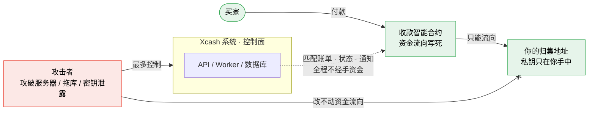
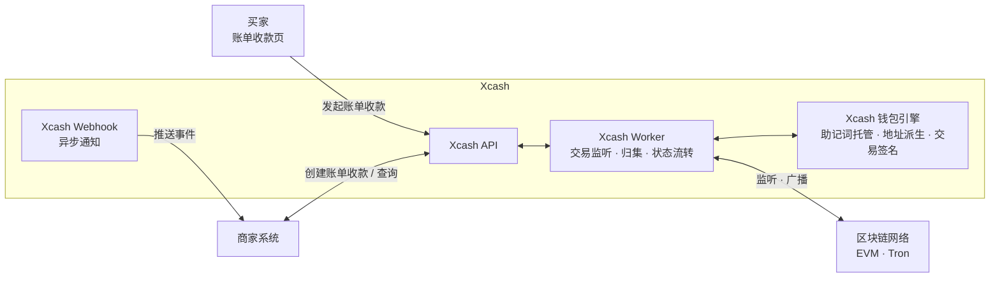

# Xcash

<p align="center">
  <strong>开源自托管加密货币收款网关</strong>
  <br />
  支持 USDT、ETH 与主流 EVM 及 Tron 链资产收款，零平台手续费，完全自托管。
</p>

<p align="center">
  <a href="https://xca.sh"></a>
  <a href="https://github.com/xca-sh/xcash/stargazers"></a>
  <a href="LICENSE"></a>
  
  
</p>

<p align="center">
  <a href="README.en.md">English</a> | 简体中文
</p>

## Xcash 是什么？

**Xcash** 是最先进的开源、自托管**加密货币收款网关**，面向商家、SaaS 产品、交易所和钱包平台，提供账单收款、USDT 收款和充值收款能力。

不同于 CoinGate、OpenNode 这类托管式收款处理商，Xcash 强调**完全自托管**：收款经智能合约直达你的归集地址，Xcash 全程不过手资金，也不抽取平台手续费。它适合需要多链资产收款、充值收款和 Webhook 通知能力的业务系统。

**适用场景：** 电商加密货币账单收款、USDT 充值收款系统、跨境稳定币结算、SaaS 加密货币订阅计费、链上收款基础设施，以及企业内部数字资产入账管理。

## Xcash 有多安全？

打个比方，如果你用 Xcash 作为项目的加密货币收款网关，即使部署 Xcash 的服务器被攻破、数据库被拖库、密钥泄露，只要保证您的归集地址不被篡改，您的资产都不会有任何安全风险，而且恢复服务后用户完成账单收款或充值收款的款项，仍然会流入您的归集地址，黑客无能为力。

## Xcash 为什么这么安全？

安全是 Xcash 与生俱来的特性，是我们秉承的核心原则。

- Xcash 永不过手您的收款。
- 一切收款走智能合约，智能合约写死资金流向为您的归集地址。
- 收款合约极简，攻击面为 0。



资金路径（绿色）由智能合约写死，只在「买家 → 收款合约 → 你的归集地址」之间流动；Xcash 仅作控制面，负责账单匹配、状态流转与通知，**不在资金路径上**。因此攻击者即便完全控制 Xcash 系统，也无法改写合约里写死的资金流向。

## 特性

| 特性 | 说明                              |
|------|---------------------------------|
| 账单收款 | 定额、定时的账单式收款，适合电商下单、订阅计费等场景      |
| 充值收款 | 为每个用户分配专属充值收款地址，随时转入、即时入账，体验同交易所  |
| 完全自托管 | 收款经智能合约直达你的钱包，Xcash 全程不过手资金     |
| 零平台手续费 | 不按交易抽成，只承担链上微量 Gas              |
| 多链多币种 | 覆盖主流 EVM 链，支持任意 ERC-20 代币 |
| 多商户多项目 | 单实例隔离管理多个商户与项目                  |
| 合约账单收款 | EVM 链可为每笔账单收款生成独立 VaultSlot 收款地址 |
| 链上风控 | 接入 MistTrack 对账单收款、充值收款的来源地址做风险评分   |
| Webhook 回调 | 实时推送账单收款、充值收款事件                     |
| 兼容易支付 | 支持标准易支付 V1 协议，便于平滑迁移            |
| Docker 部署 | Docker Compose 一键部署生产服务         |

## 账单收款 vs 充值收款

Xcash 提供两种入账方式，对接前请先区分：

- **账单收款**：账单式收款。每笔交易创建一张定额、限时的账单，买家付款后账单完成，适合电商下单、订阅计费等一次性收款场景。默认使用 VaultSlot 合约收款：系统为账单收款分配独立收款地址，地址互不冲突、天然支持高并发，金额无需浮动。
- **充值收款**：交易所式充值收款。为每个用户分配专属充值收款地址，且多链共享，实时监控，用户可随时转入、区块确认后入账，无需创建订单，适合需要维护用户余额的钱包、交易类业务。

## 链支持

| 功能 | ETH | BNB Chain | Arbitrum | Base | Tron | Polygon | Avalanche | Optimism | 其他 EVM |
|:--:|:---:|:---------:|:--------:|:----:|:----:|:-------:|:---------:|:--------:|:------:|
| 账单收款 | 是 | 是 | 是 | 是 | 是 | 是 | 是 | 是 | 几乎都支持  |
| 充值收款 | 是 | 是 | 是 | 是 | 是 | 是 | 是 | 是 | 几乎都支持  |

## 代币支持

EVM 链支持任意 ERC-20 代币，只需在后台添加代币合约地址即可启用，适合按业务需要接入 USDT、USDC 或其他链上资产收款。

Tron VaultSlot 收款仍在接入中，当前不暴露 Tron 账单收款或充值收款方式。

## 内置风控接入

Xcash 内置的是风控查询、缓存、记录和展示能力；当前风险地址识别依赖外部 MistTrack（慢雾 MistTrack）服务，并非项目内部自行维护黑名单或自研链上风控模型。

风控系统当前覆盖两类核心资金入口：

- **账单收款**：账单匹配到链上付款后，系统会对付款方地址进行异步风险查询，并将风险等级和风险分数同步到账单收款记录。
- **充值收款**：充值收款记录创建后，系统会对转入资金的来源地址进行异步风险查询，并将风险等级和风险分数同步到充值收款记录。

风险结果会同时写入独立的**风险评估**记录，包含查询状态、目标类型、来源地址、交易哈希、风险等级、风险分数。管理后台可直接查看账单收款、充值收款和风险评估记录中的风险信息，便于运营人员进行人工复核、业务放行或进一步处置。账单收款和充值收款的 API/Webhook 输出也会携带 `risk_level` 与 `risk_score`，方便商户系统同步展示或接入自己的处置流程。

Xcash 优先使用 MistTrack OpenAPI V3；未配置 MistTrack OpenAPI API Key 时，自动回退到 QuickNode MistTrack add-on。
两者都未配置，则不启用风控功能。

## 后台截图


## 架构



## 部署前准备

在开始部署之前，请准备以下条件：

- Linux 服务器，推荐 Ubuntu 22.04+ 或 Debian 12+
- Docker 和 Docker Compose
- 已解析到服务器 IP 的域名
- 需要启用的公链 RPC 节点
- 如需启用 Tron 账单收款，需要准备 TronGrid API Key

推荐服务器配置：

| 性能模式 | 硬件配置 | 仅账单收款事件监听 | 账单收款 + 充值收款事件监听 |
|:-------:|:-------:|:----------------------:|:---------------------:|
| low | 1 核 / 2 GB | 5 - 10 条 EVM 链 | 2 - 3 条 EVM 链 |
| medium | 4 核 / 8 GB | 15 - 30 条 EVM 链 | 8 - 15 条 EVM 链 |
| high | 8 核 / 16 GB | 30+ 条 EVM 链 | 15 - 30 条 EVM 链 |

`PERFORMANCE` 为可设置到 `.env` 中的性能参数，可选值为 `low`、`medium`、`high`。不设置时默认使用 `low`。

EVM 账单收款与充值收款都通过链上事件扫描感知和确认状态。实际可承载的链数量取决于 RPC 节点吞吐、区块出块速度和事件量；开启充值收款后需要监听更多地址与事件，建议按上表保守配置性能档位。

## 快速开始

### 1. 克隆项目

```bash
git clone https://github.com/xca-sh/xcash.git
cd xcash
```

### 2. 初始化环境变量

```bash
./scripts/init_env.sh
```

该命令会生成 `.env`，并自动填充运行所需的随机密钥和数据库口令。

### 3. 设置访问域名

编辑 `.env` 设置 `SITE_DOMAIN`：

```env
SITE_DOMAIN=xcash.example.com
```

请确保该域名的 DNS 已解析到服务器 IP，并配置 Nginx 或 Caddy 等反向代理，将流量转发至 `http://localhost:6688`。

### 4. 启动服务

```bash
docker compose up -d
```

首次启动时，如果数据库内还没有任何管理员账号，系统会自动创建默认后台账号：

```text
username: admin
password: Admin@123456
```

首次登录后台后请立即修改默认密码。

### 5. 配置链 RPC

系统已预置主流链的基础信息，但 **RPC 节点地址需要自行填写**，网关才能与区块链通信。

登录管理后台，进入 **区块链** **公链** 页面，为需要使用的链填写 RPC 地址。推荐使用 [QuickNode](https://www.quicknode.com/)、[Alchemy](https://www.alchemy.com/) 或 [Infura](https://www.infura.io/) 等节点服务商。Tron 账单收款需要在 [TronGrid](https://www.trongrid.io/) 注册并获取 API Key。

### 6. 为系统钱包充值 Gas

登录管理后台，进入 **系统** **系统钱包** 页面，复制系统钱包地址，并在每条启用的 EVM 链上向该地址充值少量 Gas 代币，例如 ETH、BNB、MATIC 等。

系统钱包只用于平台基础设施交易，例如 VaultSlot 合约部署、VaultSlot 归集等需要由系统主动发起的链上操作；业务收款资金仍按合约规则流向你的收款归集地址。这里不需要存入业务资金，只需要保留覆盖近期操作的小额 Gas，避免因 Gas 不足导致合约部署或归集任务无法广播。

### 7. 配置项目

登录管理后台，进入 **项目** **项目列表** 页面，创建或编辑项目。项目是 API 对接的基本隔离单元，每个项目都有独立的 `Appid` 和 `HMAC密钥`，用于接口鉴权与签名。

请至少确认以下配置：

- **IP 白名单**：限制允许调用网关 API 的商户服务器 IP；测试阶段可使用 `*`，生产环境建议收窄到固定出口 IP 或网段。
- **通知地址**：用于接收账单收款、充值收款等 Webhook 事件；如暂未配置，项目会显示为未就绪。
- **收款归集地址**：业务资金最终流入的地址。启用合约账单收款或充值收款前必须配置 EVM 多签地址；该地址会写入 VaultSlot 合约规则，一旦设置不可修改。

## API 对接

部署完成后，参考 [API 对接文档](API.md) 接入账单收款、充值收款和 Webhook 回调。

创建账单收款时可传入账单收款级 `notify_url` 覆盖项目默认 Webhook；兼容易支付 V1 的 `submit.php` 入口也会将 `notify_url` 翻译为账单收款自身的通知地址。

## 运维命令

### 停止服务

```bash
docker compose down
```

该命令会停止并移除生产 Docker Compose 服务容器，不会删除数据库数据卷。

### 升级到最新版

```bash
./scripts/upgrade.sh
```

该命令会拉取 `main` 分支最新版并执行完整生产升级流程。

## 技术栈

- **后端**：Django 5.2 + Django REST Framework
- **任务队列**：Celery + Redis
- **数据库**：PostgreSQL
- **区块链交互**：web3.py（EVM）
- **钱包派生**：BIP44 HD 钱包（bip-utils）
- **前端账单收款页**：React 19 + Vite + Tailwind CSS
- **部署**：Docker Compose

## 路线图

- [ ] Solana 链支持
- [x] Tron 链支持
- [ ] 完善文档站

## 云服务

如果你不想自己部署和维护，可以直接使用官方托管版本：

**[xca.sh](https://xca.sh)** — 开箱即用，免部署，持续更新。

## 商业支持

如果你在部署或使用过程中需要专业协助，欢迎联系我们获取技术支持服务：

tech@xca.sh

## 贡献

欢迎提交 Issue 和 Pull Request。

## License

[MIT](LICENSE)
