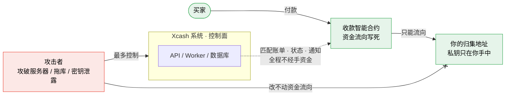
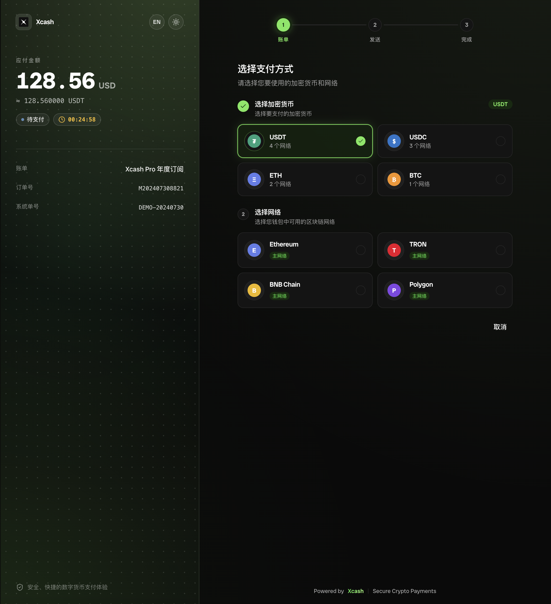
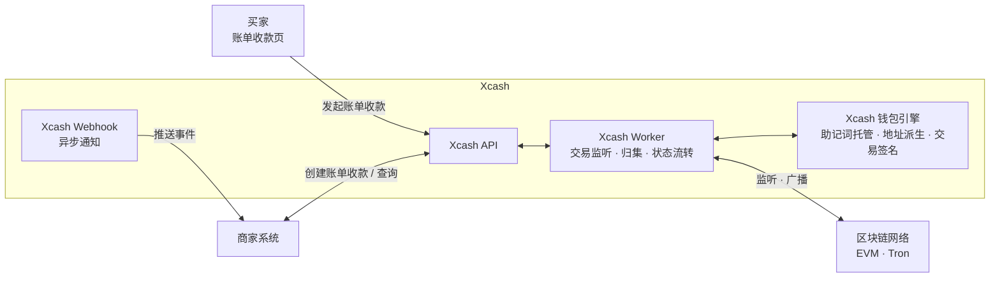

<div align="center">

[English](README.en.md) · **简体中文**

# Xcash

**开源 · 自部署 · 非托管加密货币支付网关**

支持主流 EVM 链上任意 ERC-20 代币与 Tron USDT 收款，
资金经智能合约直达你自己的钱包：**零平台手续费、免 KYC、全程不托管。**

<p>
  <a href="https://xca.sh"></a>
  <a href="https://xca.sh/docs/"></a>
  <a href="https://github.com/xca-sh/xcash/stargazers"></a>
  <a href="LICENSE"></a>
  
  
</p>

<p>
  <a href="#快速开始">快速开始</a> ·
  <a href="https://xca.sh/docs/">官方文档</a> ·
  <a href="API.md">API 参考</a> ·
  <a href="https://xca.sh">官网</a>
</p>

<sub>电商账单 · USDT 充值 · 跨境结算 · SaaS 订阅 · 钱包 / 交易所</sub>

</div>


## 为什么选 Xcash？

托管式收款处理商站在你和你的钱之间：资金先进入他们的账户、按笔抽取手续费、要求 KYC 实名，还可能冻结你的账户，甚至直接关停服务。Xcash 反其道而行：网关跑在你自己的服务器上，钱从头到尾都是你的。

- **非托管设计** —— 收款经极简智能合约流转，资金流向被写死为你的归集地址；系统不以私钥托管业务资金，即便被拖库也没有可供盗取的资产。Xcash 只负责账单匹配、确认与通知，不在资金路径上。
- **零平台手续费** —— 自部署时不按交易抽成，只需承担链上 Gas；批量归集让单次归集的开销接近一笔普通转账。
- **稳定币优先、多链覆盖** —— Ethereum、BNB Chain、Arbitrum、Base、Polygon、Optimism 等主流 EVM 链上任意 ERC-20；Tron 放行 USDT 与原生 TRX。
- **一套系统、两种收款** —— 账单收款覆盖电商下单、订阅计费；充值收款提供交易所式专属地址，适合维护用户余额的平台。
- **生产级配套开箱即用** —— 多商户多项目隔离、MistTrack 链上风控、可靠 Webhook、易支付 V1 兼容、Docker 一键部署。

### 与常见方案对比

|  | **Xcash**（自部署） | 托管处理商¹ | BTCPay Server |
|---|:---:|:---:|:---:|
| 资金托管 | 非托管，直达你的钱包 | 处理商代收，结算后放款 | 非托管 |
| 平台手续费 | **0** | 通常按笔抽 0.4%–1% | 0 |
| KYC / 开户审核 | 无 | 通常需要 | 无 |
| EVM + Tron 稳定币 | 任意 ERC-20 + Tron USDT | 视服务商而定 | 以 BTC 为主，其他币靠插件 |
| 交易所式充值地址 | 内置 | 少见 | — |
| 易支付 V1 协议 | 兼容 | — | — |

¹ 如 CoinPayments、NOWPayments、CoinGate 等。

## 快速开始

几分钟内启动一套生产网关。你需要一台装有 Docker 的 Linux 服务器和一个已解析到它的域名：

```bash
git clone https://github.com/xca-sh/xcash.git
cd xcash
./scripts/init_env.sh    # 生成 .env 并自动填充随机密钥
# 编辑 .env，设置 SITE_DOMAIN=pay.example.com
docker compose up -d
```

内置 Caddy 监听 `127.0.0.1:6688`，用你的反向代理（Nginx、Caddy 等）转发流量并配置 TLS。首次启动会创建后台账号 `admin`，其密码由 `init_env.sh` 随机生成——脚本执行完会打印一次，同时保存在 `.env` 的 `DJANGO_DEFAULT_SUPERUSER_PASSWORD`，**请存入密码管理器**。然后在管理后台完成三步：

1. 为需要启用的公链填写 RPC 节点（QuickNode / Alchemy / Infura；Tron 需要 TronGrid API Key）。
2. 为系统钱包在每条启用的链上充值少量 Gas。
3. 创建项目、设置归集地址，通过 [REST API](API.md) 完成对接。

完整步骤见下方[部署指南](#部署指南)，更多内容见[官方文档](https://xca.sh/docs/)。

> 不想自己运维？**[xca.sh](https://xca.sh)** 提供官方云服务——每月首 $500 交易额免手续费。

## 安全：为什么攻破服务器也偷不走钱？

假设部署 Xcash 的服务器被彻底攻破——数据库被拖库、密钥全部泄露。只要你的归集地址没有被篡改，你的资产就没有任何风险：事发前、事发中、恢复后用户完成的账单收款和充值收款，仍然会流入你的归集地址，因为服务器上不存在任何能改变资金流向的东西。

安全是 Xcash 与生俱来的结构性特性，而不是事后补上的功能：

- **Xcash 永不过手您的收款。** 资金不会经过任何由系统代管的账户。
- **合约收款的流向被写死。** 收款智能合约只能把资金转给你的归集地址，攻击者改不动。
- **收款合约极简。** 逻辑唯一、攻击面为 0。


```mermaid
flowchart LR
    Buyer(["买家"])
    Contract["收款智能合约<br/>资金流向写死"]
    Wallet["你的归集地址<br/>私钥只在你手中"]

    Buyer -->|付款| Contract -->|只能流向| Wallet

    subgraph XcashBox["Xcash 系统 · 控制面"]
        Core["API / Worker / 数据库"]
    end
    Core -.->|匹配账单 · 状态 · 通知<br/>全程不经手资金| Contract

    Attacker["攻击者<br/>攻破服务器 / 拖库 / 密钥泄露"]
    Attacker -->|最多控制| XcashBox
    Attacker -- 改不动资金流向 --x Wallet

    classDef money fill:#e6f4ea,stroke:#34a853,color:#000;
    classDef danger fill:#fce8e6,stroke:#ea4335,color:#000;
    class Buyer,Contract,Wallet money;
    class Attacker danger;
```

资金路径（绿色）由智能合约写死，只在「买家 → 收款合约 → 你的归集地址」之间流动；Xcash 仅作控制面，负责账单匹配、状态流转与通知，**不在资金路径上**。因此攻击者即便完全控制 Xcash 系统，最多只能看到账单数据，无法改写合约里写死的资金流向。

## 账单收款 vs 充值收款

Xcash 提供两种入账方式，对接前请先区分：

- **账单收款**：账单式收款。每笔交易创建一张定额、限时的账单，买家付款后账单完成，适合电商下单、订阅计费等一次性收款场景。支持钱包直收与智能合约收款：合约模式下系统为每张账单分配独立收款地址，地址互不冲突、天然支持高并发，金额无需浮动。
- **充值收款**：交易所式充值收款。为每个用户分配专属充值收款地址，多链共享、实时监控，用户可随时转入、区块确认后入账，无需创建订单，适合需要维护用户余额的钱包、交易类业务。

账单收款自带买家端支付页，开箱即用、支持中英双语：



## 特性

| 特性 | 说明 |
|------|------|
| 账单收款 | 定额、限时的账单式收款，适合电商下单、订阅计费等场景 |
| 充值收款 | 为每个用户分配专属充值收款地址，随时转入、确认后入账，体验同交易所 |
| 完全非托管 | 收款经智能合约直达你的钱包，Xcash 全程不过手资金 |
| 零平台手续费 | 不按交易抽成，只承担链上微量 Gas |
| 多链多币种 | 覆盖主流 EVM 链，支持任意 ERC-20 代币；Tron 放行 USDT 与 TRX |
| 多商户多项目 | 单实例隔离管理多个商户与项目，各自独立鉴权与归集地址 |
| 智能合约收款 | EVM 链可为每笔账单生成独立合约收款地址，确认后自动归集 |
| 链上风控 | 接入 MistTrack 对账单收款、充值收款的来源地址做风险评分 |
| Webhook 回调 | 实时推送账单收款、充值收款事件，自动重试，基于 Nonce 幂等去重 |
| 兼容易支付 | 支持标准易支付 V1 协议，便于平滑迁移 |
| REST API | 简洁的 RESTful 接口，HMAC-SHA256 签名认证 |
| Docker 部署 | Docker Compose 一键部署生产服务 |

## 接入你现有的技术栈

看你在跑什么系统，很多情况下根本不用写对接代码：

- **WooCommerce** —— 官方 **Xcash for WooCommerce** 插件，几步为你的 WordPress 商店加上 USDT、USDC 等加密货币结账。[下载插件](https://xca.sh/#integration)
- **易支付生态** —— 只要系统支持标准易支付 V1 协议，无需改造原有对接逻辑即可直接接入：Xboard、V2board、New API、独角数卡、异次元发卡（WHMCS 开发中）。

其余场景走 [REST API](API.md)：几个 HMAC 签名的调用即可创建账单收款、分配专属充值地址；Webhook 实时推送收款事件，并携带 MistTrack 风险评分。

## 链支持

| 功能 | ETH | BNB Chain | Arbitrum | Base | Tron | Polygon | Optimism |
|:--:|:---:|:---------:|:--------:|:----:|:----:|:-------:|:--------:|
| 账单收款 | 是 | 是 | 是 | 是 | 是 | 是 | 是 |
| 充值收款 | 是 | 是 | 是 | 是 | 是 | 是 | 是 |

更多 EVM 链只需在管理后台填写 RPC 节点即可启用。

## 代币支持

| 链类型 | 原生资产 | 代币标准 | 当前支持范围 | 启用方式 |
|:------:|:--------:|:--------:|:------------|:---------|
| EVM | ETH、BNB、POL 等原生资产（用于支付 Gas） | ERC-20 | 支持任意 ERC-20 代币，按业务需要接入 USDT、USDC 或其他链上资产 | 在后台添加代币合约地址并启用对应公链 |
| Tron | TRX | TRC-20 | 当前放行 USDT 与原生 TRX；其他 TRC-20 暂不作为收款资产 | 配置 Tron 链 RPC / TronGrid，并启用对应资产 |

## Gas 成本与资金归集

启用智能合约收款后，系统会为每笔账单收款、每个充值收款用户分配**独立的收款地址**。很多人第一反应会担心：地址这么多，是不是每笔收款都要单独付一次 Gas 去归集？

答案是**不需要**。Xcash 内置两道归集闸门，把归集次数和 Gas 开销压到最低：

- **归集延迟（周期性批量归集）**：收款确认后不会立即归集，而是等待一个可配置的延迟窗口再尝试。EVM 链默认 **60 分钟**，Tron 链默认 **6 小时**。同一地址在窗口内的多笔入账会被**合并成一次归集**，而不是每笔各付一次 Gas。
- **归集金额门槛**：到期尝试归集时，若该地址该币种的余额价值低于门槛（默认 **1 USD**），则**跳过本次并继续累积**，避免为几毛钱的"粉尘"付出更高的 Gas、注定亏本。

**只有「延迟到达」和「金额达标」两个条件同时满足，系统才会自动发起归集交易。** 未达标的地址不会被丢弃，后续入账会重新评估，攒够门槛后再归集。两道闸门的具体数值都可以在管理后台按链灵活调整。

同时，Xcash 的收款合约保持极简：每次归集的核心动作基本等同于对应代币的一次普通转账，所以单次归集的 Gas 消耗也基本接近该代币转账本身，几乎没有额外合约开销。

更巧妙的是，归集本身是一个**无需许可、与安全无关**的操作：

- 归集合约的 `collect()` **没有任何权限校验**，任何账户都能替你发起归集，调用方只是自付 Gas；而资金流向早已被合约写死为你的归集地址，谁来触发都改变不了结果。
- 所以除了系统按闸门自动归集，你也可以在**任何时间手动触发归集**，不受延迟和门槛限制。
- 无论自动还是手动、无论谁来调用，归集资金**只会流入你的归集地址**，Xcash 全程不过手（原理见[「安全」](#安全为什么攻破服务器也偷不走钱)）。

因此你只需为系统钱包保留少量原生资产用于支付归集 Gas（见[部署步骤 6](#6-为系统钱包充值-gas)），无需为每笔支付或充币单独操心 Gas——真正的 Gas 开销，由你设定的归集频率与门槛共同决定。

## 内置风控接入

Xcash 内置的是风控查询、缓存、记录和展示能力；当前风险地址识别依赖外部 MistTrack（慢雾 MistTrack）服务，并非项目内部自行维护黑名单或自研链上风控模型。

风控系统当前覆盖两类核心资金入口：

- **账单收款**：账单匹配到链上付款后，系统会对付款方地址进行异步风险查询，并将风险等级和风险分数同步到账单收款记录。
- **充值收款**：充值收款记录创建后，系统会对转入资金的来源地址进行异步风险查询，并将风险等级和风险分数同步到充值收款记录。

风险结果会同时写入独立的**风险评估**记录，包含查询状态、目标类型、来源地址、交易哈希、风险等级、风险分数。管理后台可直接查看账单收款、充值收款和风险评估记录中的风险信息，便于运营人员进行人工复核、业务放行或进一步处置。账单收款和充值收款的 API/Webhook 输出也会携带 `risk_level` 与 `risk_score`，方便商户系统同步展示或接入自己的处置流程。

Xcash 优先使用 MistTrack OpenAPI V3；未配置 MistTrack OpenAPI API Key 时，自动回退到 QuickNode MistTrack add-on。
两者都未配置，则不启用风控功能。

## 架构


```mermaid
graph LR
    Buyer["买家<br/>账单收款页"]
    Merchant["商家系统"]

    subgraph Xcash
        API["Xcash API"]
        Worker["Xcash Worker<br/>交易监听 · 归集 · 状态流转"]
        Wallet["Xcash 钱包引擎<br/>助记词托管 · 地址派生 · 交易签名"]
        Webhook["Xcash Webhook<br/>异步通知"]
    end

    Blockchain["区块链网络<br/>EVM · Tron"]

    Buyer -->|发起账单收款| API
    Merchant <-->|创建账单收款 / 查询| API
    API <--> Worker
    Worker <--> Wallet
    Worker <-->|监听 · 广播| Blockchain
    Webhook -->|推送事件| Merchant
```

## 部署指南

### 部署前准备

- Linux 服务器，推荐 Ubuntu 22.04+ 或 Debian 12+
- Docker 和 Docker Compose
- 已解析到服务器 IP 的域名
- 需要启用的公链 RPC 节点
- 如需启用 Tron 账单收款，需要准备 TronGrid API Key

推荐服务器配置：

| 性能模式 | 硬件配置 | 可承载链数量 |
|:-------:|:-------:|:-----------:|
| low | 1 核 / 2 GB | 2 - 3 条 EVM 链 |
| medium | 4 核 / 8 GB | 8 - 15 条 EVM 链 |
| high | 8 核 / 16 GB | 15 - 30 条 EVM 链 |

`PERFORMANCE` 为可设置到 `.env` 中的性能参数，可选值为 `low`、`medium`、`high`。不设置时默认使用 `low`。

EVM 账单收款与充值收款都通过链上事件扫描感知和确认状态，且二者均默认启用、需要同时监听。实际可承载的链数量取决于 RPC 节点吞吐、区块出块速度和事件量，建议按上表保守配置性能档位。

### 1. 克隆项目

```bash
git clone https://github.com/xca-sh/xcash.git
cd xcash
```

### 2. 初始化环境变量

```bash
./scripts/init_env.sh
```

该命令会生成 `.env`，并自动填充运行所需的随机密钥和数据库口令。
如果 `.env` 已存在，脚本会拒绝覆盖并退出；如需重新生成，请先手动备份并删除旧文件。

### 3. 设置访问域名

编辑 `.env` 设置 `SITE_DOMAIN`：

```env
SITE_DOMAIN=xcash.example.com
```

请确保该域名的 DNS 已解析到服务器 IP，并配置 Nginx 或 Caddy 等反向代理，将流量转发至 `http://localhost:6688`。

#### 反向代理必须转发真实客户端 IP 与协议

**这一步不是可选项。** 网关的商户 IP 白名单、登录限流和全部 API 限流都以真实客户端 IP 为判定依据；HSTS 与 Secure Cookie 则依赖请求协议判定。如果你的反向代理没有转发这两项信息，Xcash 只能看到 Docker 网关地址，后果是：

- 商户 IP 白名单对所有请求失效（配了白名单的商户会被全部拒绝）；
- 所有 IP 维度限流塌缩成「全站共用一个桶」，任何人都能打满登录限流，形成针对全体管理员的登录拒服；
- Django 始终认为请求是明文 HTTP，HSTS 不下发。

**Nginx 示例：**

```nginx
location / {
    proxy_pass http://127.0.0.1:6688;
    proxy_set_header Host $host;
    # 真实客户端 IP。必须用 $remote_addr（覆写语义）
    proxy_set_header X-Real-IP $remote_addr;
    # 原始请求协议，HSTS 与 Secure Cookie 依赖它
    proxy_set_header X-Forwarded-Proto $scheme;
}
```

> ⚠️ 不要用 `proxy_set_header X-Forwarded-For $proxy_add_x_forwarded_for;` 作为唯一来源。那是**追加**语义，链最左侧的值来自客户端请求头、可被任意伪造。Xcash 优先采信 `X-Real-IP`，所以按上面写就是安全的。

**Caddy 示例**（Caddy 会自动转发 `X-Forwarded-For` 与 `X-Forwarded-Proto`，无需手动设置）：

```caddyfile
xcash.example.com {
    reverse_proxy 127.0.0.1:6688
}
```

**若把 6688 端口对外暴露**（在 `.env` 里设置 `LISTEN_TO=0.0.0.0`，例如反向代理部署在另一台机器），必须同时收紧受信代理范围，否则任何能连到该端口的来源都可以伪造客户端 IP：

```env
# 默认为 private_ranges（信任私有网段），改成反向代理机器的具体 IP
CADDY_TRUSTED_PROXIES=203.0.113.10
```

可选：设置 `ADMIN_PATH` 将后台入口移动到自定义路径，例如：

```env
ADMIN_PATH=secure-admin
```

未设置时后台仍挂在站点根路径，并会在后台右上角显示安全提醒。

### 4. 启动服务

```bash
docker compose up -d
```

启动脚本会先执行数据库迁移并补齐默认链、币种等主数据。首次启动时，如果数据库内还没有任何管理员账号，系统会自动创建后台账号 `admin`，密码取自 `.env` 中的 `DJANGO_DEFAULT_SUPERUSER_PASSWORD`（由 `scripts/init_env.sh` 随机生成，执行时打印过一次）。

出于安全考虑，生产环境（`DEBUG=False`）下该口令若为空、短于 12 位、或等于仓库内置的示例值，系统会**拒绝创建管理员并中止升级**——后台在未设置 `ADMIN_PATH` 时挂在站点根路径，弱口令等同于把超管拱手让人。

建议同时设置 `ADMIN_PATH` 把后台移到非默认路径。

### 5. 配置链 RPC

系统已预置主流链的基础信息，但 **RPC 节点地址需要自行填写**，网关才能与区块链通信。

登录管理后台，进入 **区块链 → 公链** 页面，为需要使用的链填写 RPC 地址。推荐使用 [QuickNode](https://www.quicknode.com/)、[Alchemy](https://www.alchemy.com/) 或 [Infura](https://www.infura.io/) 等节点服务商。Tron 账单收款需要在 [TronGrid](https://www.trongrid.io/) 注册并获取 API Key。

### 6. 为系统钱包充值 Gas

登录管理后台，进入 **系统 → 系统钱包** 页面，复制系统钱包地址，并在每条启用的 EVM 链上向该地址充值少量原生资产用于支付 Gas，例如 ETH、BNB、POL 等。

系统钱包只用于平台基础设施交易，例如智能合约部署、智能合约归集等需要由系统主动发起的链上操作；业务收款资金仍按合约规则流向你的收款归集地址。这里不需要存入业务资金，只需要保留覆盖近期操作的小额 Gas，避免因 Gas 不足导致合约部署或归集任务无法广播。归集并非每笔收款各触发一次——系统通过归集延迟与金额门槛两道闸门批量归集，进一步压低 Gas 开销，详见[「Gas 成本与资金归集」](#gas-成本与资金归集)。

### 7. 配置项目

登录管理后台，进入 **项目 → 项目列表** 页面，创建或编辑项目。项目是 API 对接的基本隔离单元，每个项目都有独立的 `Appid` 和 `HMAC密钥`，用于接口鉴权与签名。

请至少确认以下配置：

- **IP 白名单**：限制允许调用网关 API 的商户服务器 IP；测试阶段可使用 `*`，生产环境建议收窄到固定出口 IP 或网段。
- **通知地址**：用于接收账单收款、充值收款等 Webhook 事件；如暂未配置，项目会显示为未就绪。
- **收款归集地址**：业务资金最终流入的地址。启用智能合约收款或充值收款前必须配置 EVM 多签地址；该地址会写入智能合约规则，一旦设置不可修改。

## API 对接

部署完成后，参考 [API 对接文档](https://xca.sh/docs/#api-base) 接入账单收款、充值收款和 Webhook 回调。仓库内的 [API.md](API.md) 提供完整接口参考。

创建账单收款时可传入账单收款级 `notify_url` 覆盖项目默认 Webhook；兼容易支付 V1 的 `submit.php` 入口也会将 `notify_url` 翻译为账单收款自身的通知地址。

## 备份与恢复

### 必须成对备份的两样东西

Xcash 的助记词以 AES-256-GCM 加密入库，加密密钥不在数据库里，而在 `.env` 的 `WALLET_MNEMONIC_ENCRYPTION_KEY`。因此：

| 备份内容 | 位置 | 只有它的后果 |
| --- | --- | --- |
| Postgres 数据 | `db` 容器 / `db_data` 卷 | 助记词无法解密，等于没备份 |
| `.env` | 项目根目录 | 没有业务数据，等于没备份 |

**两者必须作为一对、同一时点一起备份。** 任何一份单独存在都无法恢复钱包。`WALLET_MNEMONIC_ENCRYPTION_KEY` 一旦丢失即不可恢复——热钱包私钥永久失效、归集能力全部失效。

> `scripts/upgrade.sh` 在迁移演练中生成的 dump **不是备份**：演练成功后会立即删除，只在演练失败时保留供排查。请另行建立独立的定期备份。

### 备份数据库

```bash
docker compose exec -T db sh -c 'pg_dump --format=custom --no-owner --no-privileges -U "$POSTGRES_USER" -d "$POSTGRES_DB"' > xcash-$(date +%Y%m%d-%H%M%S).dump
```

建议：

- 至少每天一次，并把 dump 与 `.env` 一起加密后传到**服务器之外**的存储（同机备份无法应对磁盘损坏与主机丢失）；
- `.env` 内容长期不变，可离线保存一份（如密码管理器或纸质），无需每天重传；
- 定期做一次**恢复演练**——没验证过的备份不能算备份。

### 恢复

```bash
# 1. 停止业务服务，保留数据库
docker compose stop django worker beat

# 2. 把 .env 恢复到位（务必是与该 dump 同时点的那一份）

# 3. 灌入 dump（目标库需为空库）
docker compose exec -T db sh -c 'pg_restore --exit-on-error --no-owner --no-privileges -U "$POSTGRES_USER" -d "$POSTGRES_DB"' < xcash-YYYYmmdd-HHMMSS.dump

# 4. 拉起服务
docker compose up -d
```

## 运维命令

查看各服务运行与健康状态（`healthy` / `unhealthy` 来自内置健康检查）：

```bash
docker compose ps
```

停止服务（移除服务容器，保留数据库数据卷）：

```bash
docker compose down
```

升级到最新版（拉取 `main` 分支最新版并执行完整生产升级流程）：

```bash
./scripts/upgrade.sh
```

扩容 Celery worker（业务量增长时，`PERFORMANCE` 档位之外的横向扩容手段）：

```bash
docker compose up -d --scale worker=3
```

## 技术栈

- **后端**：Django 5.2 + Django REST Framework
- **任务队列**：Celery + Redis
- **数据库**：PostgreSQL
- **区块链交互**：web3.py（EVM）
- **钱包派生**：BIP44 HD 钱包（bip-utils）
- **前端账单收款页**：React 19 + Vite + Tailwind CSS
- **部署**：Docker Compose

## 路线图

- [x] Tron 链支持
- [ ] Solana 链支持
- [ ] 完善文档站

## 官方云服务

如果你不想自己部署和维护，可以直接使用官方托管版本：**[xca.sh](https://xca.sh)** —— 开箱即用、免部署、免运维、持续更新。

云服务按月交易额分段计费，每段只按本段费率收取：**每月首 $500 免手续费**，之后随交易量 1% → 0.8% → 0.6% → 0.4% 递减。自部署始终免费、零平台手续费。

## 支持

- **Bug 与使用问题**：[提交 Issue](https://github.com/xca-sh/xcash/issues)
- **商业技术支持**：tech@xca.sh

## 贡献

欢迎提交 Issue 和 Pull Request，参与方式见 [CONTRIBUTING.md](CONTRIBUTING.md)。

如果 Xcash 帮你省了钱，欢迎点一个 ⭐——这能让更多商户发现这个项目。

## License

[MIT](LICENSE)
